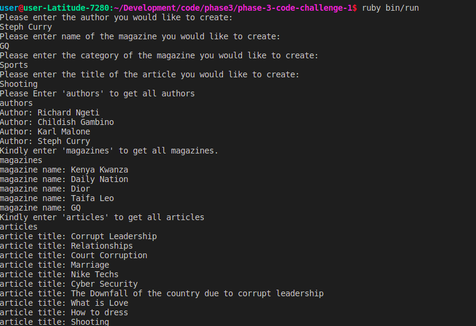

# Project Title
Articles- Without AR

# Project Description
This project implements the use of instances, classes, class and Instance methods, variable scope, object relationships, and arrrays and array Methods in ruby.

#  Tools Used
This project was built with the following tools:
* Ruby ~ v2.7.+
* Documentation on the Ruby language can be found here: Ruby Docs

# Pre-requisites
In order to use this repo you need to have the following installed:
* OS [either: Windows 10+, Linux or MacOS(running on x86 or arm architecture)]
* Ruby - 2.7.+

# Installation
* To use this repo on your machine requires some simple steps

# Alternative One
* Open a terminal / command line interface on your computer
* Clone the repo by using the following:
  git clone https://github.com/richard200/phase-3-code-challenge-1
* Change directory to the repo folder using cd repo_name
* (Optional) Open it in Visual Studio Code
  code .
* (Alternate Option) Open it in any editor of your choice.

# Alternative Two
* On the top right corner of this page there is a button labelled Fork.
* Click on that button to fork the repo to your own account.
* Take on the process in Alternative One above.
* Remember to replace your username when cloning.

# Running the application
To run the application:
* Install required dependencies using bundle ie bundle install
* Run the application on the terminal using ruby bin/run

# Demo screenshot
Here is a screenshot of the terminal where the application is running from

# Authors
This project was contributed to by:
- [Richard Ngeti](https://github.com/richard200/)

# License

The project is licensed under ISC.
